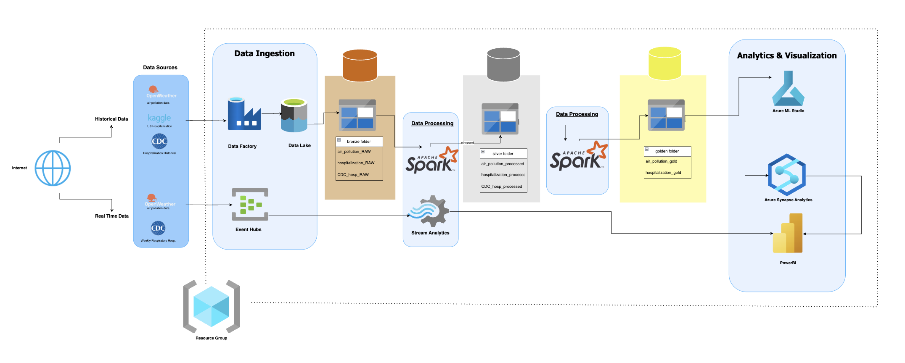

# Azure_AirPollution_Weather_Analysis
Analysis of Boston's Air pollution and weather on Azure cloud.
A comprehensive solution for collecting, processing, and visualizing air pollution and weather data using Azure cloud services.

## Architecture Overview
This solution uses multiple Azure services to process weather data from OpenWeather API:

- **Data Ingestion**: Azure Functions trigger data collection from OpenWeather API
- **Data Processing**: Azure Synapse Analytics and Azure Data Factory process and transform raw data
- **Data Storage**: Azure Storage accounts store both raw and processed data
- **Analytics**: Azure Synapse Analytics for complex querying and analysis
- **Visualization**: Power BI dashboards provide insights on weather patterns and air pollution metrics

## Key Features
- Real-time weather data collection
- Air pollution analysis and correlation with weather patterns
- Scalable data processing pipeline
- Interactive visualizations and dashboards
- Historical data analysis capabilities
