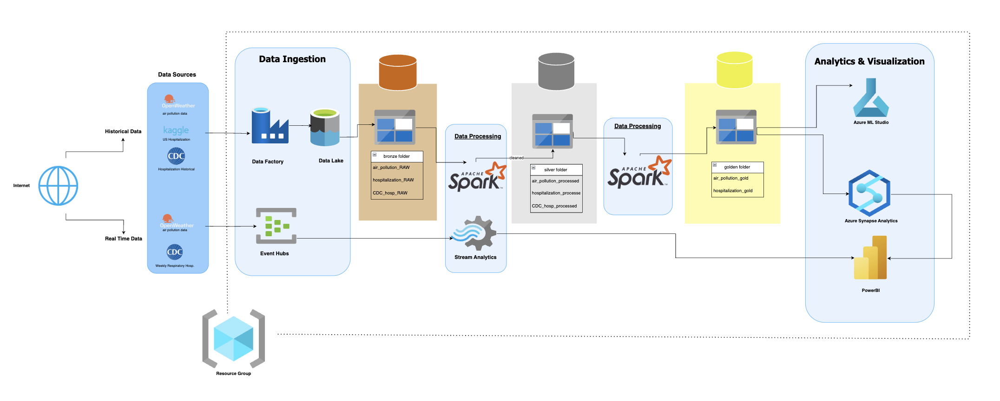

# Architecture Overview

This document details the architecture of the Azure Weather & Air Pollution Analytics platform.

## High-Level Architecture

## Component Details

### Data Collection Layer
- **Azure Functions (Harshfunctionapp)**
  - Scheduled triggers fetch data from OpenWeather API
  - Separates data into weather and air pollution streams
  - Validates and formats incoming data
  - Writes raw data to Azure Storage

### Data Storage Layer
- **Azure Storage Account (harshshahstorage)**
  - Raw data container: Stores unprocessed API responses
  - Processed data container: Stores cleaned and transformed data
  - Archive container: Stores historical data for long-term analysis

### Data Processing Layer
- **Azure Data Factory (Harsh-Shah-DataFactory)**
  - Orchestrates overall data processing workflow
  - Manages data movement between storage and analytics services
  - Schedules daily processing jobs
  
- **Azure Synapse Analytics (harsh-synapse)**
  - SQL scripts for data transformation and aggregation
  - Spark notebooks for complex analytics
  - Data enrichment and feature engineering

- **Stream Analytics Job (Harsh_stream_analytics_ds598)**
  - Real-time processing of incoming data
  - Sliding window calculations for moving averages
  - Anomaly detection for air quality alerts

### Event Processing Layer
- **Event Hubs Namespace (harsh598namespace)**
  - Manages event streams for real-time notifications
  - Handles high-volume data ingestion
  - Enables event-driven architecture

### Visualization Layer
- **Power BI**
  - Interactive dashboards for data exploration
  - Scheduled reports for stakeholders
  - Customizable visualizations for different metrics

## Data Flow

1. **Data Collection**
   - Azure Function triggers every 30 minutes
   - API calls fetch current weather and air quality data
   - Data is validated and stored in Azure Storage

2. **Batch Processing**
   - Data Factory pipeline triggers daily
   - Raw data is processed and aggregated
   - Results stored in processed data container

3. **Real-time Processing**
   - Stream Analytics processes data as it arrives
   - Real-time aggregations and calculations
   - Anomaly detection for unusual conditions

4. **Analytics**
   - Synapse Analytics performs advanced analytics
   - Weather and air quality data correlation
   - Trend analysis and pattern recognition

5. **Visualization**
   - Power BI connects to processed data
   - Dashboards update automatically
   - Users interact with visualization layer
