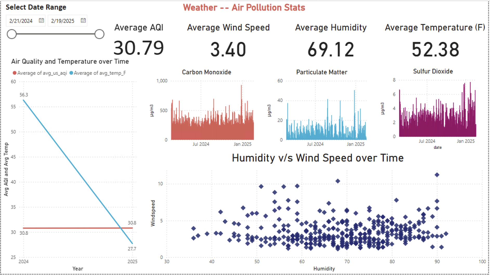

# Usage Examples

This document demonstrates common use cases for the Weather & Air Pollution Analytics platform.

## Scenario 1: Analyzing Air Quality Trends

### Use Case
Identify trends in air quality over time and correlate with weather conditions.

### Steps
1. Open the Power BI dashboard
2. Navigate to "Air Quality Trends" tab
3. Select the desired date range
4. Observe the correlation between temperature, humidity, and air quality indices

### Sample Insights
- PM2.5 levels tend to increase during periods of low wind speed
- Ozone concentrations peak during hot, sunny days
- Air quality generally improves after rainfall events

## Scenario 2: Real-time Air Quality Monitoring

### Use Case
Monitor current air quality conditions and receive alerts for poor air quality.

### Steps
1. Access the "Real-time Monitoring" dashboard
2. Set up alert thresholds for specific pollutants
3. Configure notification preferences

### Implementation Details
The real-time monitoring uses:
- Azure Function triggers that run every 30 minutes
- Stream Analytics processing for immediate analysis
- Event Hubs for notification routing

## Scenario 3: Weather Pattern Analysis

### Use Case
Analyze historical weather patterns to identify seasonal trends.

### Steps
1. Open the Power BI dashboard
2. Navigate to "Weather Patterns" tab
3. Select the location and time period
4. Use the pattern analysis tool to identify recurring trends

### Sample Insights
- Temperature variations over the year follow expected seasonal patterns
- Humidity levels correlate strongly with precipitation events
- Wind patterns show consistent directional trends during specific seasons

## Scenario 4: Custom Reporting

### Use Case
Generate custom reports for specific locations or time periods.

### Steps
1. Open the Power BI dashboard
2. Navigate to "Report Builder" tab
3. Select metrics, time range, and locations
4. Generate and export the report as PDF or Excel

### Available Metrics
- Temperature (min, max, average)
- Humidity levels
- Air Quality Index
- Individual pollutant concentrations
- Weather conditions
